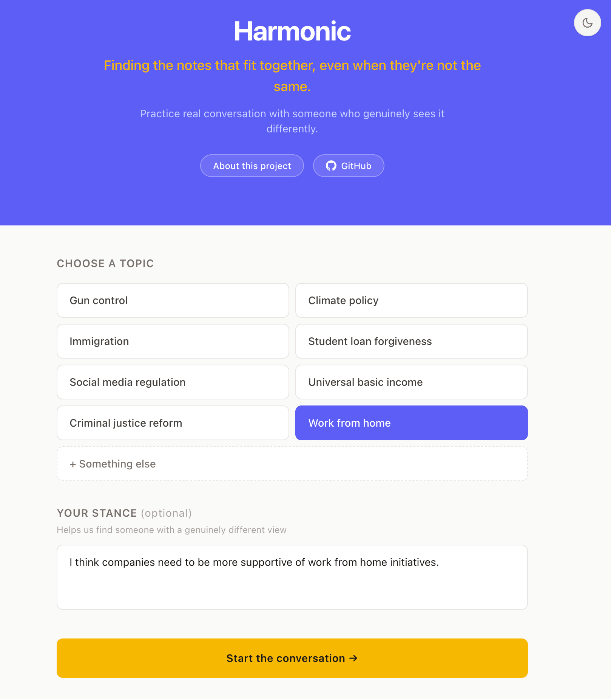
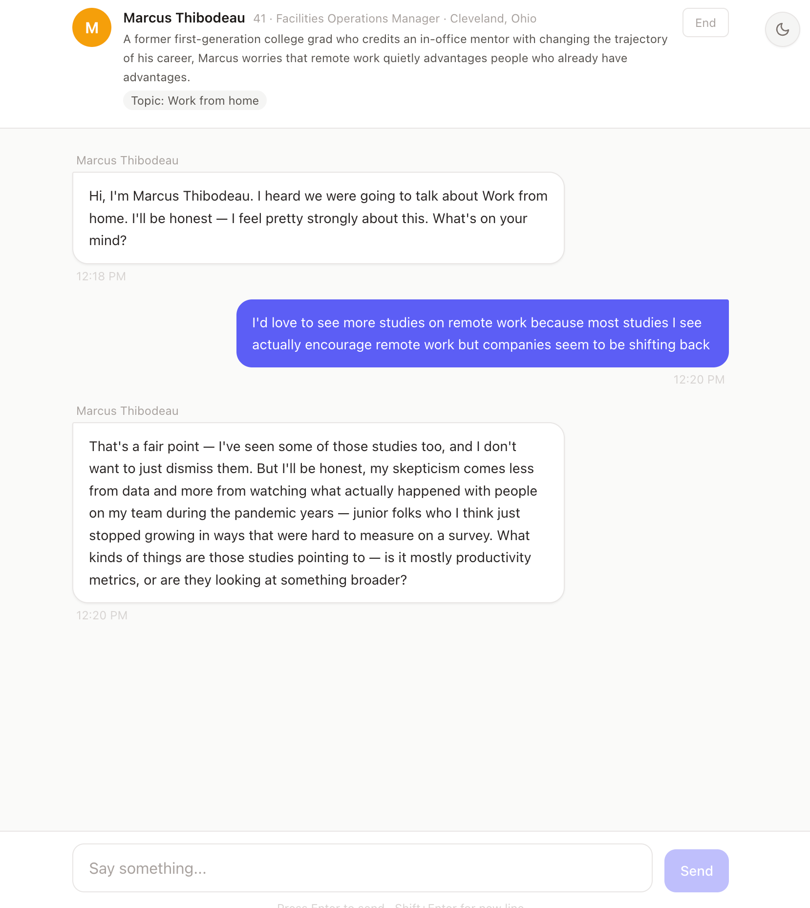
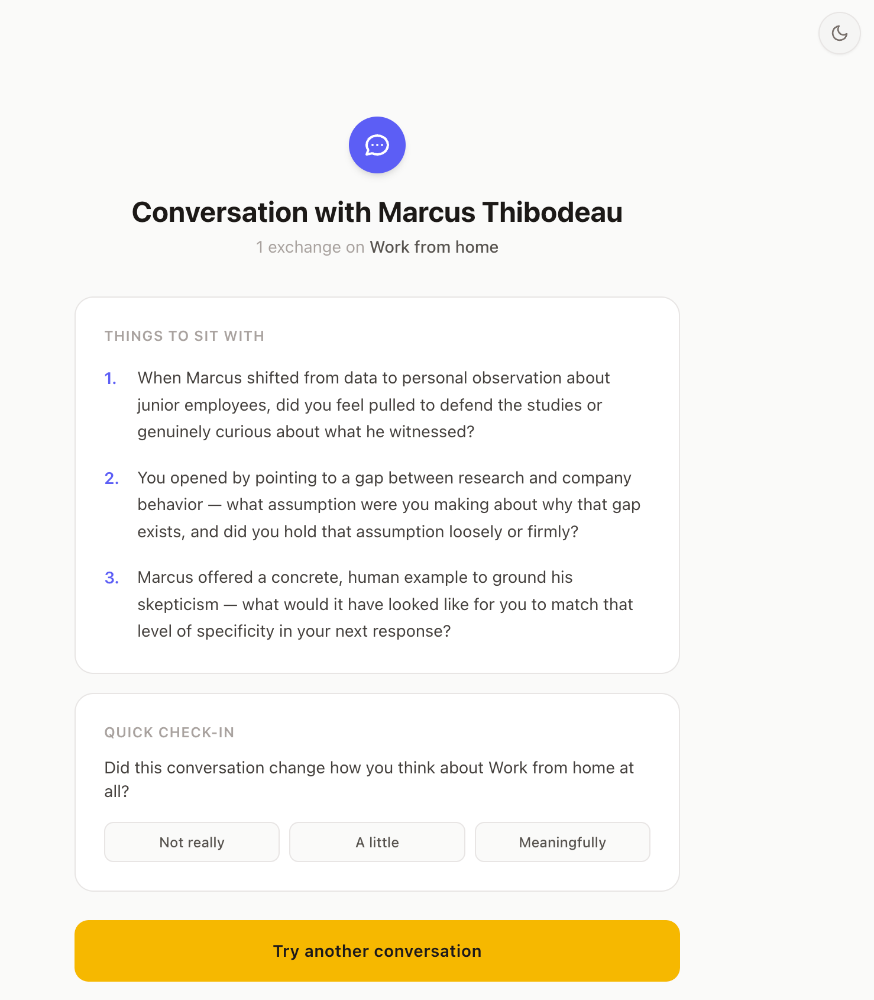

# Harmonic

> Finding the notes that fit together, even when they're not the same.

A dialogue practice tool. Pick a topic, meet a realistic AI conversation partner who holds a different view, and practice constructive engagement.

**Live:** [harmonic.nickwenner.com](https://harmonic.nickwenner.com)
**About / write-up:** [harmonic.nickwenner.com/#/about](https://harmonic.nickwenner.com/#/about)

---

## Screenshots

| Topic Selection | Conversation | Reflection |
|---|---|---|
|  |  |  |

---

## Architecture

```
harmonic.nickwenner.com
    ↓ CloudFront → S3
React SPA (Vite + TypeScript + Tailwind)
    ↓ fetch to Lambda Function URL
AWS Lambda (Node.js 20, arm64) — bundled with esbuild
    ↓
Anthropic Claude API (claude-sonnet-4-6)
```

**API key security:** The Anthropic API key is stored in AWS SSM Parameter Store (`/harmonic/anthropic-api-key` as a `SecureString`) and fetched at Lambda cold start. It is never in source code, environment variables, or CloudFormation.

---

## Project Structure

```
harmonic/
├── frontend/                         # Vite + React + TypeScript + Tailwind
│   ├── src/
│   │   ├── components/
│   │   │   ├── TopicSelector.tsx     # Landing: pick topic + optional stance
│   │   │   ├── PersonaCard.tsx       # Sticky header showing AI partner info
│   │   │   ├── ChatInterface.tsx     # Main chat loop + fixed input bar
│   │   │   ├── MessageBubble.tsx     # User / AI message styling
│   │   │   ├── TypingIndicator.tsx   # Animated dots while waiting for reply
│   │   │   ├── ConversationEnd.tsx   # Reflection + perspective-shift check-in
│   │   │   ├── ThemeToggle.tsx       # Light / dark toggle (persisted to localStorage)
│   │   │   └── About.tsx             # Project write-up at /#/about
│   │   ├── hooks/
│   │   │   ├── useConversation.ts    # All state management + API calls
│   │   │   └── useTheme.ts           # Dark mode state + localStorage sync
│   │   ├── types/index.ts
│   │   ├── App.tsx                   # Router (HashRouter) + state machine: select → chat → end
│   │   └── main.tsx
│   └── package.json
│
├── backend/                          # AWS Lambda (Node.js 20)
│   └── src/handler.ts                # 3 request types: generate_persona · chat · reflection
│
├── cdk/                              # AWS CDK (TypeScript)
│   ├── bin/harmonic.ts               # Entry — reads CERTIFICATE_ARN from env
│   ├── lib/harmonic-stack.ts         # Lambda + Function URL + S3 + CloudFront + ACM import
│   └── cdk.json
│
└── scripts/
    └── deploy-site.sh                # npm run build → s3 sync → CloudFront invalidation
```

---

## Setup

### Prerequisites

- Node 20+
- AWS CLI configured with a profile that has permissions for Lambda, S3, CloudFront, SSM, CDK
- CDK bootstrapped once: `cd cdk && npm run cdk -- bootstrap`
- An ACM certificate for `harmonic.nickwenner.com` **in us-east-1** (required by CloudFront even if deploying to another region)
- Anthropic API key stored in SSM:
  ```bash
  aws ssm put-parameter \
    --name /harmonic/anthropic-api-key \
    --value sk-ant-... \
    --type SecureString \
    --profile wenroe
  ```

### Environment (`.env` at repo root)

Copy and fill in:

```bash
CERTIFICATE_ARN=arn:aws:acm:us-east-1:ACCOUNT:certificate/CERT-ID
S3_BUCKET=                  # filled in after first CDK deploy
CF_DISTRIBUTION_ID=         # filled in after first CDK deploy
AWS_PROFILE=wenroe
AWS_REGION=us-east-2
```

---

## Deploying

### Infrastructure (CDK)

```bash
cd cdk
npm install
npm run deploy        # sources ../.env automatically, uses --profile wenroe
```

CDK provisions: Lambda function + Function URL (with CORS), S3 bucket, CloudFront distribution, ACM certificate attachment, SSM read permissions.

After the first deploy, copy the `SiteBucketName` and `CloudFrontDistributionId` outputs into `.env`.

### Frontend

```bash
cd frontend
npm install
npm run deploy        # runs scripts/deploy-site.sh: build → s3 sync → CF invalidation
```

### Backend-only redeploy

```bash
cd cdk && npm run deploy
```

CDK detects the Lambda source changed and updates only the function code.

---

## Local Dev

```bash
cd frontend
npm run dev
# Proxies API calls to VITE_API_URL in .env.local
# Create frontend/.env.local with: VITE_API_URL=https://your-lambda-url
```
